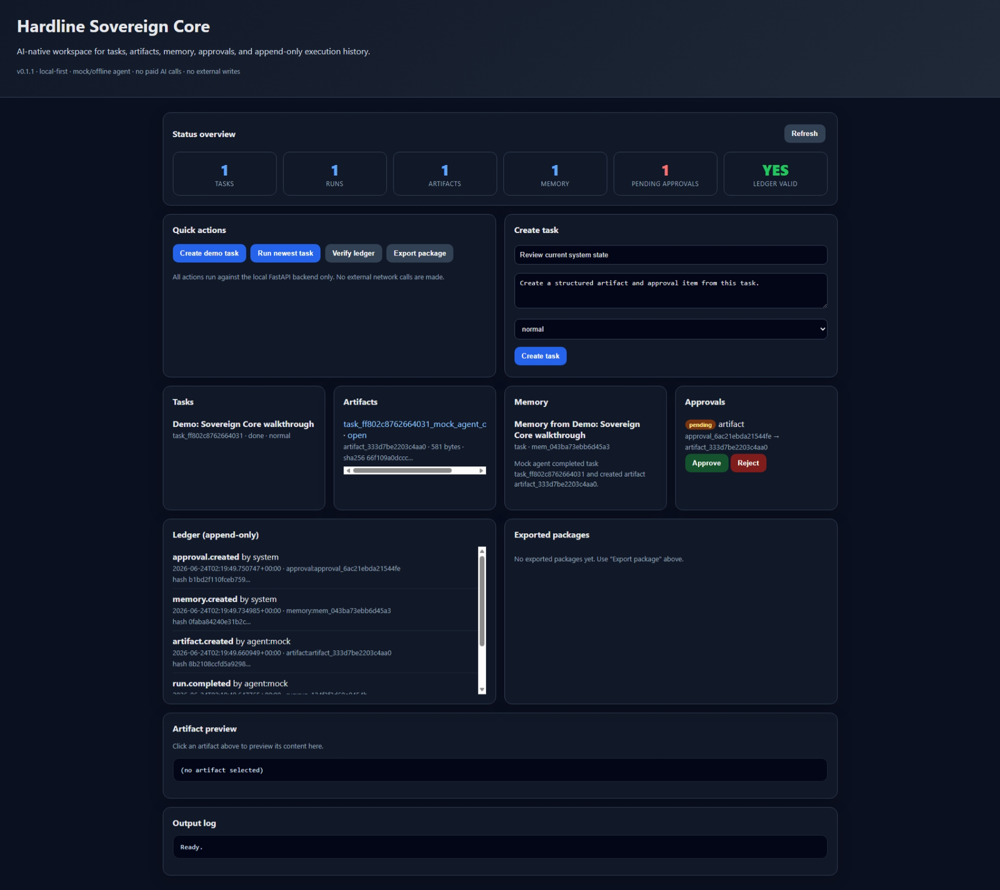
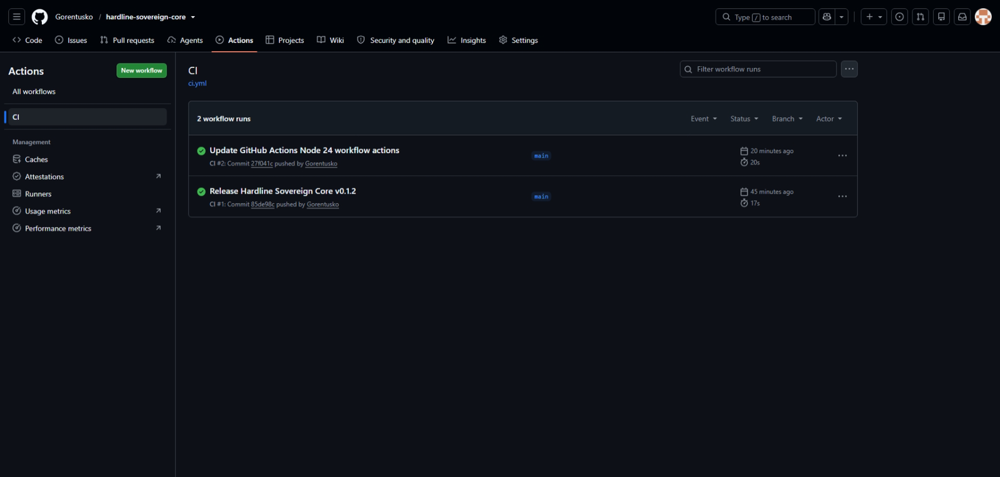
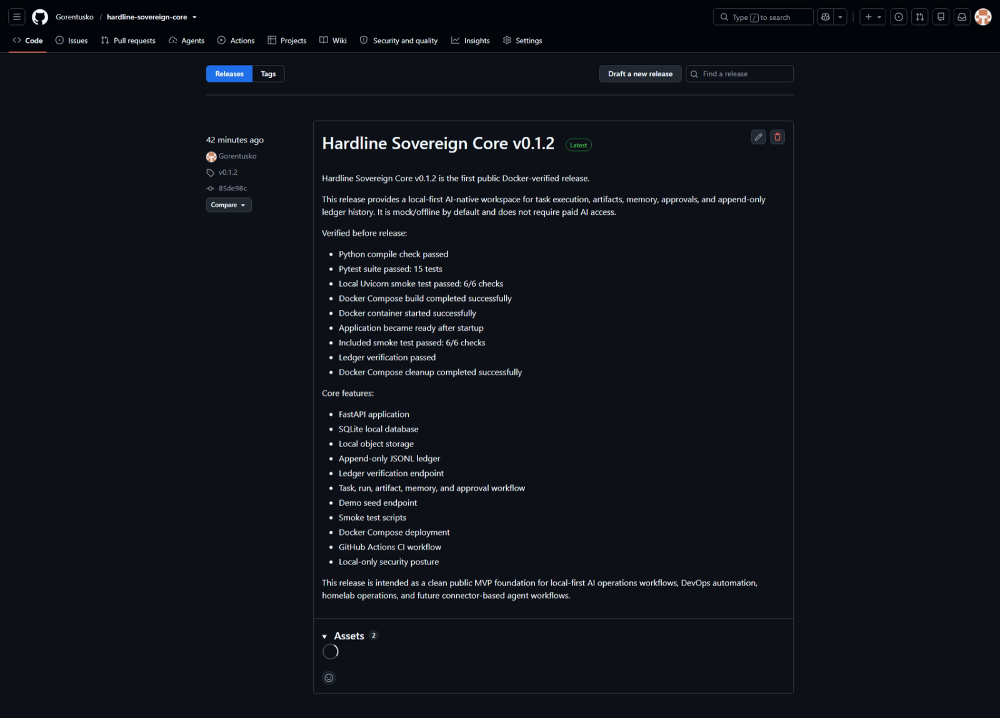
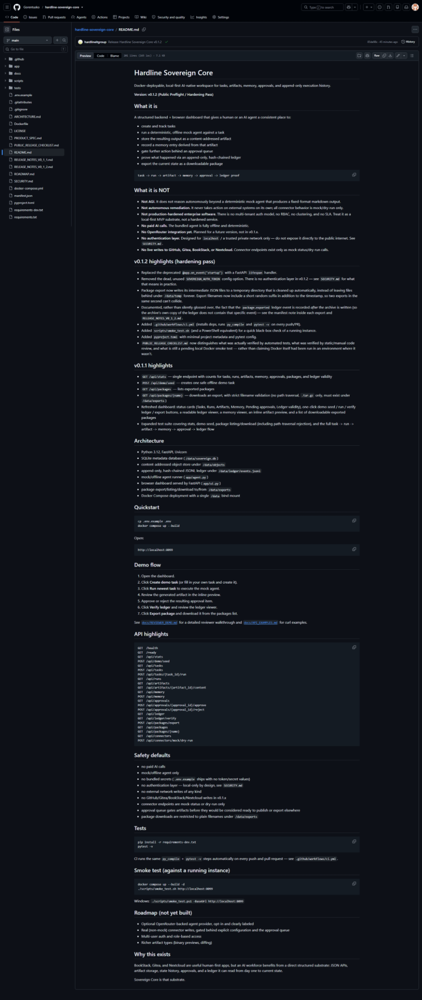

# Hardline Sovereign Core

Docker-deployable, local-first AI-native workspace for tasks, artifacts,
memory, approvals, and append-only execution history.

**Version: v0.1.2 (Public Preflight / Hardening Pass)**


## Screenshots

### Dashboard



### Validation and release

| GitHub Actions CI | Release v0.1.2 |
|---|---|
|  |  |

### Repository overview



## What it is

A structured backend + browser dashboard that gives a human or an AI agent
a consistent place to:

- create and track tasks
- run a deterministic, offline mock agent against a task
- store the resulting output as a content-addressed artifact
- record a memory entry derived from that artifact
- gate further action behind an approval queue
- prove what happened via an append-only, hash-chained ledger
- export the current state as a downloadable package

```text
task -> run -> artifact -> memory -> approval -> ledger proof
```

## What it is NOT

- **Not AGI.** It does not reason autonomously beyond a deterministic mock
  agent that produces a fixed-format markdown output.
- **Not autonomous remediation.** It never takes action on external
  systems on its own; all connector behavior is mock/dry-run only.
- **Not production-hardened enterprise software.** There is no
  multi-tenant auth model, no RBAC, no clustering, and no SLA. Treat it as
  a local-first MVP substrate, not a hardened service.
- **No paid AI calls.** The bundled agent is fully offline and
  deterministic.
- **No OpenRouter integration yet.** Planned for a future version, not in
  v0.1.x.
- **No authentication layer.** Designed for `localhost` / a trusted
  private network only — do not expose it directly to the public
  internet. See `SECURITY.md`.
- **No live writes to GitHub, Gitea, BookStack, or Nextcloud.** Connector
  endpoints exist only as mock status/dry-run calls.

## v0.1.2 highlights (hardening pass)

- Replaced the deprecated `@app.on_event("startup")` with a FastAPI
  `lifespan` handler.
- Removed the dead, unused `SOVEREIGN_AUTH_TOKEN` config option. There is
  no authentication layer in v0.1.2 — see `SECURITY.md` for what that
  means in practice.
- Package export now writes its intermediate JSON files to a temporary
  directory that is cleaned up automatically, instead of leaving files
  behind under `/data/temp` forever. Export filenames now include a short
  random suffix in addition to the timestamp, so two exports in the same
  second can't collide.
- Documented, rather than silently glossed over, the fact that the
  `package.exported` ledger event is recorded *after* the archive is
  written (so the archive's own copy of the ledger does not contain that
  specific event) — see the manifest note inside each export and
  `RELEASE_NOTES_V0_1_2.md`.
- Added `.github/workflows/ci.yml` (installs deps, runs `py_compile` and
  `pytest -v` on every push/PR).
- Added `scripts/smoke_test.sh` (and a PowerShell equivalent) for a quick
  black-box check of a running instance.
- Added `pyproject.toml` with minimal project metadata and pytest config.
- `PUBLIC_RELEASE_CHECKLIST.md` now distinguishes what was actually
  verified by automated tests, what was verified by static/manual code
  review, and what is still a pending local Docker smoke test — rather
  than claiming Docker itself had been run in an environment where it
  wasn't.

## v0.1.1 highlights

- `GET /api/stats` — single endpoint with counts for tasks, runs,
  artifacts, memory, approvals, packages, and ledger validity
- `POST /api/demo/seed` — creates one safe offline demo task
- `GET /api/packages` — lists exported packages
- `GET /api/packages/{name}` — downloads an export, with strict filename
  validation (no path traversal, `.tar.gz` only, must exist under
  `/data/exports`)
- Refreshed dashboard: status cards (Tasks, Runs, Artifacts, Memory,
  Pending approvals, Ledger validity), one-click demo seed / run / verify
  ledger / export buttons, a readable ledger viewer, a memory viewer, an
  inline artifact preview, and a list of downloadable exported packages
- Expanded test suite covering stats, demo seed, package listing/download
  (including path-traversal rejection), and the full
  task -> run -> artifact -> memory -> approval -> ledger flow

## Architecture

- Python 3.12, FastAPI, Uvicorn
- SQLite metadata database (`/data/sovereign.db`)
- content-addressed object store under `/data/objects`
- append-only, hash-chained JSONL ledger under `/data/ledger/events.jsonl`
- mock/offline agent runner (`app/agent.py`)
- browser dashboard served by FastAPI (`app/ui.py`)
- package export/listing/download to/from `/data/exports`
- Docker Compose deployment with a single `/data` bind mount

## Quickstart

```bash
cp .env.example .env
docker compose up --build
```

Open:

```text
http://localhost:8099
```

## Demo flow

1. Open the dashboard.
2. Click **Create demo task** (or fill in your own task and create it).
3. Click **Run newest task** to execute the mock agent.
4. Review the generated artifact in the inline preview.
5. Approve or reject the resulting approval item.
6. Click **Verify ledger** and review the ledger viewer.
7. Click **Export package** and download it from the packages list.

See [`docs/REVIEWER_DEMO.md`](docs/REVIEWER_DEMO.md) for a detailed
reviewer walkthrough and [`docs/API_EXAMPLES.md`](docs/API_EXAMPLES.md)
for curl examples.

## API highlights

```text
GET  /health
GET  /ready
GET  /api/stats
POST /api/demo/seed
GET  /api/tasks
POST /api/tasks
POST /api/tasks/{task_id}/run
GET  /api/runs
GET  /api/artifacts
GET  /api/artifacts/{artifact_id}/content
GET  /api/memory
POST /api/memory
GET  /api/approvals
POST /api/approvals/{approval_id}/approve
POST /api/approvals/{approval_id}/reject
GET  /api/ledger
GET  /api/ledger/verify
POST /api/packages/export
GET  /api/packages
GET  /api/packages/{name}
GET  /api/connectors
POST /api/connectors/mock/dry-run
```

## Safety defaults

- no paid AI calls
- mock/offline agent only
- no bundled secrets (`.env.example` ships with no token/secret values)
- no authentication layer — local-only by design, see `SECURITY.md`
- no external network writes of any kind
- no GitHub/Gitea/BookStack/Nextcloud writes in v0.1.x
- connector endpoints are mock-status or dry-run only
- approval queue gates artifacts before they would be considered ready to
  publish or export elsewhere
- package downloads are restricted to plain filenames under `/data/exports`

## Tests

```bash
pip install -r requirements-dev.txt
pytest -v
```

CI runs the same `py_compile` + `pytest -v` steps automatically on every
push and pull request — see `.github/workflows/ci.yml`.

## Smoke test (against a running instance)

```bash
docker compose up --build -d
./scripts/smoke_test.sh http://localhost:8099
```

Windows: `./scripts/smoke_test.ps1 -BaseUrl http://localhost:8099`

## Roadmap (not yet built)

- Optional OpenRouter-backed agent provider, opt-in and clearly labeled
- Real (non-mock) connector writes, gated behind explicit configuration
  and the approval queue
- Multi-user auth and role-based access
- Richer artifact types (binary previews, diffing)

## Why this exists

BookStack, Gitea, and Nextcloud are useful human-first apps, but an AI
workforce benefits from a direct structured substrate: JSON APIs,
artifact storage, state history, approvals, and a ledger it can read from
day one to current state.

Sovereign Core is that substrate.

